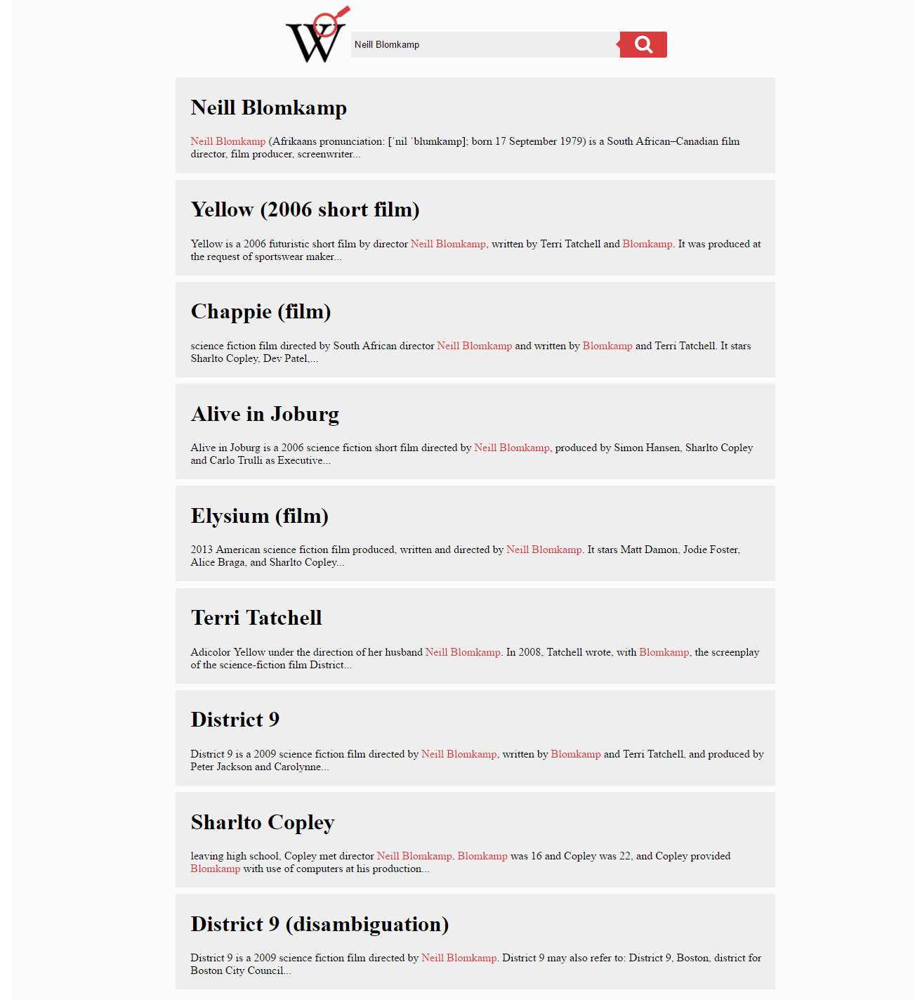

# Wikipedia Viewer
A Wikipedia viewer I have created while going through the intermediate front end development project challenges at www.freeCodeCamp.org

## [Front End Development Projects](https://github.com/Squibs/freeCodeCamp#freecodecamp) (Go Back to My freeCodeCamp Repository)

### [Wikipedia Viewer](https://squibs.github.io/wikipedia-viewer/) (Click to view functional site)

<em>Completed June 15, 2017</em>

The third intermediate front end development project I completed while completing lessons on freeCodeCamp. For this project I created a simple site that uses the Wikipedia API to display search results from the user-entered information in the textbox. 

As this project was fairly similar to the previous two intermediate front end development projects, I decided to focus on learning more about CSS flexbox and grids. I use both of these in this project for my page layout.

I wanted to complete this project without the use of jQuery as well, in order to learn what jQuery has been doing for me in my previous projects. I have found out that it simply makes accomplishing simple tasks such as targeting html elements, changing CSS, or making AJAX calls simpler by reducing the amount of lines needed to accomplish the same task without jQuery.

        
